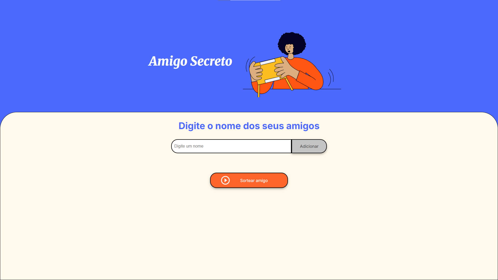

# Projeto Amigo Secreto - Desafio do Curso One Oracle

Este projeto foi desenvolvido como parte do **Curso One Oracle** e consiste em uma aplicação web simples para realizar o sorteio de **Amigo Secreto**. O usuário pode adicionar os nomes dos amigos, visualizar a lista e realizar o sorteio de forma intuitiva e rápida.

---

## ✨ Funcionalidades

A aplicação oferece as seguintes funcionalidades:

- **Adicionar Amigos**: Insira o nome de amigos para incluí-los na lista.
- **Visualizar Lista**: Veja todos os amigos cadastrados.
- **Sorteio Aleatório**: Clique no botão "Sortear amigo" para realizar o sorteio de um amigo secreto aleatório.

---

## 🛠️ Tecnologias Utilizadas

Este projeto foi desenvolvido utilizando as seguintes tecnologias:

- **HTML5**: Para a estrutura da página.
- **CSS3**: Para o design e estilização da interface.
- **JavaScript**: Para a lógica de adicionar amigos e realizar o sorteio.

---

## 📥 Como Usar

1. **Adicionar Amigos**:
   - Digite o nome de um amigo na caixa de texto.
   - Clique no botão **Adicionar** para incluir o nome na lista.
   
2. **Realizar o Sorteio**:
   - Clique no botão **Sortear amigo** para sortear um amigo secreto aleatório.
   - O nome do amigo sorteado aparecerá logo abaixo do botão.

3. **Validações**:
   - Se você tentar adicionar um nome vazio, será exibida uma mensagem de alerta.
   - Se não houver amigos na lista, o sorteio não poderá ser realizado e você será notificado.

---

## 📂 Estrutura de Arquivos

Aqui está a estrutura de arquivos do projeto:

```
/amigo-secreto
  ├── index.html       # Estrutura HTML da página
  ├── style.css        # Estilos e design da página
  └── app.js           # Lógica JavaScript para interação
```

---

## 🚀 Como Rodar o Projeto Localmente

Para rodar este projeto em sua máquina local:

1. Clone este repositório ou baixe os arquivos.
2. Abra o arquivo `index.html` em seu navegador.
3. Interaja com a aplicação adicionando amigos e realizando o sorteio.

---

## 📸 Visualização do Projeto



---

**Aproveite seu sorteio de amigo secreto e divirta-se!** 🎉🎁
